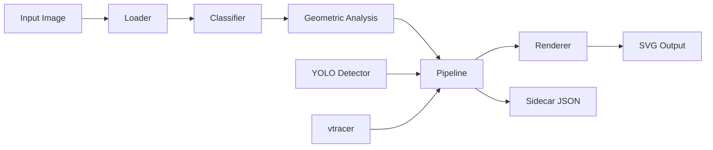
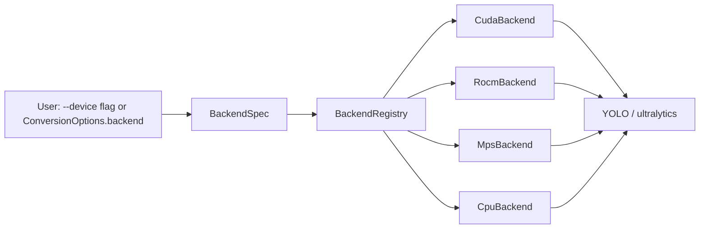

# img2svg

Convert raster images to clean, optimized SVG using YOLO segmentation and [vtracer](https://github.com/visioncortex/vtracer).

[](https://opensource.org/licenses/BSD-3-Clause)
[](https://www.python.org/downloads/)

## Overview

img2svg turns bitmaps into vector graphics without the manual tracing work. You point it at a PNG, a JPG, a WebP, or any common raster format, and it returns an SVG plus a JSON sidecar carrying the metadata that produced it. The output is small, semantically meaningful, and editable in any vector tool.

Under the hood, img2svg combines a [YOLO](https://docs.ultralytics.com/) object detector with [vtracer](https://github.com/visioncortex/vtracer), a high quality color quantizer and path tracer. YOLO segments the image into labeled regions, and vtracer fills each region with smooth, optimized SVG paths. A heuristic classifier picks the right rendering mode for the content (logo, photo, diagram, line art) so you do not have to choose. A typeless `auto` mode makes sensible defaults for most inputs.

Use it from the command line for one-off conversions and batch jobs, or call the Python API from your own pipelines. The library autodetects NVIDIA, AMD, and Apple Silicon GPUs and falls back to CPU when none is available.

## Features

- Five output modes (`auto`, `labels`, `visual`, `annotated`, `trace`) covering semantic SVGs, traced bitmaps, and annotated overlays
- Automatic content classification that picks a sensible mode without user input
- YOLO 11 detection integrated with vtracer for clean, semantically grouped paths
- Batch conversion with glob, directory, and recursive directory inputs
- Rich progress bars for long batch jobs
- JSON sidecar output recording mode, model, device, hash, timings, and per-detection metadata for reproducibility
- Multi-vendor GPU autodetect: NVIDIA CUDA, AMD ROCm (via PyTorch CUDA builds), Apple MPS
- XDG Base Directory compliant configuration, data, and cache paths
- Cross-platform support for Linux, macOS, and FreeBSD
- Both a Typer-based CLI and a clean Python API

## Quickstart

Install the package, convert a single image, and inspect the output.

```bash
pip install img2svg
img2svg photo.png -o photo.svg
cat photo.json
```

## Installation

img2svg targets Python 3.10 or newer. Pick the install method that fits your workflow.

### What GPU do you have?

The runtime picks the right compute backend automatically. The decision tree below helps you pick the right PyTorch wheel **before** you install, because PyTorch's GPU support is baked into the wheel and cannot be changed after the fact.

- **NVIDIA discrete GPU** (`nvidia-smi` works) → see [NVIDIA (CUDA)](docs/installation.md#nvidia-cuda). Install the matching `cu1xx` PyTorch wheel.
- **AMD discrete GPU or APU** (`lspci | grep -i amd` shows a Radeon device) → see [AMD (ROCm)](docs/installation.md#amd-rocm). Install the `rocm6.x` wheel. If the AMD device is an iGPU with only 512 MB of addressable VRAM, use `--model yolo11n.pt` (YOLO11x will not fit).
- **Apple Silicon Mac** (`uname -m` reports `arm64`) → see [Apple Silicon (MPS)](docs/installation.md#apple-silicon-mps). The default macOS wheel includes MPS support.
- **No GPU / CPU only** (Intel Mac, headless server, CI runner) → see [CPU (no GPU)](docs/installation.md#cpu-no-gpu). The default PyPI wheel is CPU-only.

Not sure? The bundled script probes the host and prints the right install command:

```bash
./scripts/install_backend.sh
```

### pip

```bash
pip install img2svg
```

### uv

```bash
uv add img2svg
```

### From source

```bash
git clone https://github.com/cloudbsdorg/img2svg.git
cd img2svg
uv sync --all-extras
uv run img2svg --version
```

### Detailed instructions

The full per-vendor guide (what you have → what to install → how to verify) lives in the [installation docs](docs/installation.md). The four first-class backends are NVIDIA CUDA, AMD ROCm, Apple MPS, and CPU.

## Usage: CLI

The default command is `convert`. Pass an input path and an output path.

```bash
# Convert a single file
img2svg input.png -o output.svg

# Convert every PNG in a directory
img2svg "photos/*.png" -o svg/

# Convert a whole directory recursively
img2svg photos/ -o svg/ --recursive

# Pick a specific mode
img2svg logo.png -o logo.svg --mode labels

# Use a smaller YOLO model for faster runs
img2svg photo.png -o photo.svg --model yolo11n.pt

# Run on CPU only
img2svg photo.png -o photo.svg --device cpu

# List detected GPUs and the recommended one
img2svg list-gpus

# Show version, Python, and OS info
img2svg info
```

## Usage: Python API

For scripted work, import the public API and call `convert` or `convert_batch` directly.

```python
from img2svg import convert, convert_batch, ConversionOptions, Mode

# Convert a single image.
result = convert("photo.png", "photo.svg")
print(f"wrote {result.svg_path}")
print(f"sidecar: {result.sidecar_path}")

# Convert a batch with explicit options.
options = ConversionOptions(mode=Mode.LABELS, conf=0.3, device="cpu")
results = convert_batch("photos/*.png", output_dir="svg/", options=options)
for r in results:
    if r.errors:
        print(f"failed: {r.svg_path}: {r.errors[0]}")
    else:
        print(f"ok: {r.svg_path} ({len(r.detections)} detections)")
```

## Architecture

The conversion flow is a linear pipeline. Each stage feeds the next, and the sidecar JSON branches off at the end so the metadata always reflects exactly what was rendered.



### Backend architecture

The compute side of the pipeline goes through a vendor-neutral `DeviceBackend` protocol. Four concrete backends ship in the box, and a central `BackendRegistry` owns the auto-detect chain.



The four backends and the priority order in which the registry tries them:

| Order | Backend    | When it wins                                  |
|-------|------------|-----------------------------------------------|
| 1     | CUDA       | A CUDA-capable NVIDIA GPU is visible to PyTorch. |
| 2     | ROCM       | PyTorch is a ROCm build and an AMD device is present. |
| 3     | MPS        | Running on Apple Silicon with a recent PyTorch. |
| 4     | CPU        | Always available. Universal fallback.         |

Priority is `CUDA > ROCM > MPS > CPU`. The first backend that reports `is_available()` wins; CPU is the always-on safety net. Each backend reports device name, total and free memory, and the ultralytics string the YOLO loader needs (`cuda:N`, `mps`, `cpu`).

v1 dispatches the YOLO detector through PyTorch wheels, not ONNX Runtime. This keeps the runtime surface uniform across vendors (PyTorch hides the CUDA/ROCm/HIP distinction). An ONNX Runtime migration is on the v2 roadmap.

For a deeper dive into the `DeviceBackend` protocol, the `BackendType` enum, and how to add a new backend, see [`docs/backends.md`](docs/backends.md).

## Output Modes

The `--mode` flag controls how the renderer combines YOLO detections with vtracer output.

| Mode | Description |
|------|-------------|
| `auto` | Classifier picks `labels`, `visual`, or `trace` based on the image type. The default. |
| `labels` | Semantic SVG with bounding boxes and YOLO class labels. Best for diagrams, screenshots, and line art. |
| `visual` | vtracer default preset. Photographic, color-rich, no detection overlays. |
| `annotated` | vtracer default preset plus YOLO detection overlays. Useful for inspection and debugging. |
| `trace` | vtracer photo preset. Higher path fidelity for detailed photographs. |

## GPU Support

img2svg autodetects available accelerators at startup. The pipeline reads `torch.cuda.is_available()` for NVIDIA and AMD (ROCm PyTorch builds report CUDA), then `torch.backends.mps.is_available()` for Apple Silicon. The first matching device is used unless you override with `--device`.

Supported vendors:

- **NVIDIA CUDA**: any GPU visible to your CUDA-enabled PyTorch build
- **AMD ROCm**: surfaced through a ROCm PyTorch build (`+rocm` wheels)
- **Apple MPS**: Apple Silicon Macs running PyTorch 2.0 or newer

List detected devices and the recommended one:

```bash
img2svg list-gpus
```

## Configuration

img2svg follows the [XDG Base Directory Specification](https://specifications.freedesktop.org/basedir-spec/basedir-spec-latest.html) for user-level paths. Set the relevant environment variables to override the defaults.

| Path | Default | Override |
|------|---------|----------|
| Config directory | `~/.config/img2svg/` | `$XDG_CONFIG_HOME` |
| Data directory | `~/.local/share/img2svg/` | `$XDG_DATA_HOME` |
| Cache directory (incl. YOLO model cache) | `~/.cache/img2svg/` | `$XDG_CACHE_HOME` |
| System config (FreeBSD/CloudBSD) | `/usr/local/etc/cloudbsd/img2svg` | n/a |

User configuration is read from `<config_dir>/config.toml` if present. An empty or missing file is not an error.

## Platform Support

| Platform | Status | Notes |
|----------|--------|-------|
| Linux | Full support | Required target. All features available. |
| macOS | Supported | Apple Silicon uses MPS. Intel Macs fall back to CPU. |
| FreeBSD | Best-effort | CPU only. GPU acceleration depends on community PyTorch ports. |

## Development

Clone the repo and install the dev extras, then run the test suite.

```bash
git clone https://github.com/cloudbsdorg/img2svg.git
cd img2svg
uv sync --all-extras
```

Common tasks:

```bash
# Run the test suite
uv run pytest

# Lint and format
uv run ruff check src tests
uv run ruff format src tests

# Type check
uv run mypy src

# Build the documentation site
uv run mkdocs serve
```

## License

img2svg is released under the **BSD-3-Clause** License. See [LICENSE](LICENSE) for the full text.

## Author

[Mark LaPointe](https://github.com/cloudbsdorg) &lt;mark@cloudbsd.org&gt;

Project home: [github.com/cloudbsdorg/img2svg](https://github.com/cloudbsdorg/img2svg)
