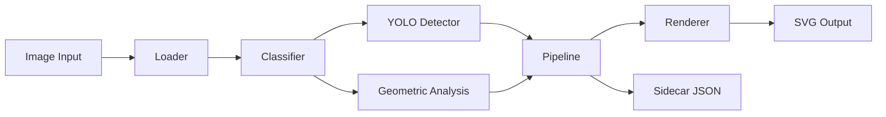
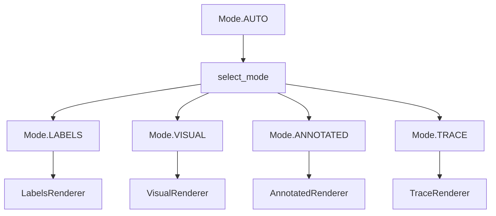
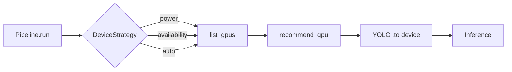

# Architecture

`img2svg` is organized as a small core orchestrator (`Pipeline`) that composes a sequence of well-defined stages, with pluggable renderers at the end. This page is the tour of the internals — the pipeline stages, the renderer registry, and the GPU dispatch.

If you are looking for the public API surface, see [Python API](api.md). This page is for contributors and reviewers.

## High-level layout

```
   ┌──────────────┐    ┌──────────────┐    ┌──────────────┐
   │  CLI / API   │───▶│   Pipeline   │───▶│   Renderer   │───▶  SVG + JSON
   └──────────────┘    └──────────────┘    └──────────────┘
                              │
                              ▼
                       ┌──────────────┐
                       │ Detector /   │
                       │ Classifier   │
                       └──────────────┘
```

- **CLI / API** — the entry points. The CLI (`img2svg.cli`) is a Typer app. The Python API (`img2svg.api`) exports `convert()` and `convert_batch()`. Both delegate to the same `Pipeline`.
- **Pipeline** — `img2svg.pipeline.Pipeline` owns the 12-step sequence. Constructing one is cheap; pass the same instance to multiple `.run()` calls in a batch to amortize YOLO load time.
- **Detector / Classifier** — `img2svg.detector` wraps Ultralytics YOLO. `img2svg.classifier` is a non-ML heuristic on alpha, dominant colors, and edge density.
- **Renderer** — one of four classes registered in `RENDERER_REGISTRY`. See the [Renderer composition](#renderer-composition) section below.

## Pipeline flowchart

The full sequence from input image to SVG + sidecar:



The 12 steps inside the `Pipeline.run()` are documented inline in the source with step-marker comments. The high-level flow is:

1. **Load** the image via `img2svg.loader.load_image()`.
2. **Analyze globally** — dominant colors, edge density, contour count, alpha presence (`img2svg.patterns.analyze_global`).
3. **Classify** the image type (`logo`, `photo`, `diagram`, `screenshot`, `line_art`, `unknown`).
4. **Select mode** — if the user passed `Mode.AUTO`, pick a concrete mode from the classification. Otherwise honor the user's choice.
5. **Detect** objects with YOLO segmentation (skipped for `Mode.TRACE`).
6. (Per-ROI analysis is currently a no-op; the spec defers it.)
7. **Resolve device** — pick the GPU per the strategy, or fall back to CPU.
8. **Build the renderer** from the resolved mode.
9. **Render** the SVG via the renderer's `.render(svg, image, detections, analysis)` method.
10. **Write** the SVG atomically.
11. **Write** the sidecar JSON atomically.
12. **Return** the `ConversionResult`.

`Mode.AUTO` is the only mode that goes through step 4; explicit modes skip it. The pipeline is strict about this — `RENDERER_REGISTRY` does not have an entry for `Mode.AUTO`, so the lookup would fail if step 4 were skipped.

## Renderer composition

Each `Mode` value maps to a renderer class via `img2svg.pipeline.RENDERER_REGISTRY`. `Mode.AUTO` is intentionally absent — the pipeline resolves it first via `select_mode()`.



The four renderer classes all subclass `img2svg.renderers.base.Renderer`, which defines the contract:

```python
class Renderer:
    def __init__(self, svg: SVGDocument, image: LoadedImage,
                 detections: list[Detection],
                 geometric: GeometricAnalysis) -> None: ...
    def render(self) -> None: ...
```

The constructor stashes the inputs, and `.render()` is the only side-effecting call. This makes renderers trivial to unit-test: build a `SVGDocument` and a fake `LoadedImage`, call the renderer, and assert the SVG tree.

| Mode         | Renderer class                          | What it does                                       |
|--------------|------------------------------------------|----------------------------------------------------|
| `LABELS`     | `img2svg.renderers.labels.LabelsRenderer` | Embeds image, draws labeled bounding boxes.      |
| `VISUAL`     | `img2svg.renderers.visual.VisualRenderer` | Embeds image, vectorizes with vtracer.            |
| `ANNOTATED`  | `img2svg.renderers.annotated.AnnotatedRenderer` | vtracer output plus labeled bounding boxes.  |
| `TRACE`      | `img2svg.renderers.trace.TraceRenderer`  | vtracer output only, no image, no labels.         |

The `VisualRenderer` and `TraceRenderer` share a private helper `_render_with_vtracer()` that lives in `visual.py` and is imported by `trace.py`. The `AnnotatedRenderer` calls the same helper first, then appends detection groups — the vtracer group is the background, the detection groups are the foreground. SVG paint order follows document order, so this layering works out automatically.

## GPU dispatch

The detector is the only stage that touches the GPU. Dispatch happens once per `Pipeline` instance:



`list_gpus()` tries three sources in order:

1. `nvidia-smi` — direct subprocess call, returns NVIDIA GPUs with VRAM and utilization.
2. `rocm-smi` — direct subprocess call, returns AMD GPUs.
3. `torch.cuda` — falls back to PyTorch's CUDA enumeration (works for both NVIDIA CUDA and AMD ROCm builds).

The first non-empty result wins. If all three return nothing, the pipeline runs on CPU.

`recommend_gpu(gpus, strategy)` picks the best device. The `power` strategy picks the largest total VRAM; `availability` picks the largest free VRAM; `auto` returns the first device in index order. On a tie, the smaller index wins (the `key=` lambda uses `-g.index` to break ties toward smaller indices).

The chosen device string is passed to YOLO via `.to(device)`, which lazy-loads the model and moves it to the device on first inference. Subsequent calls in the same `Pipeline` reuse the loaded model.

## Sidecar metadata

The sidecar is a JSON file written next to the SVG with the same name plus `.json`. The schema is fixed by `img2svg.models.Sidecar`:

```json
{
  "version": "0.1.0",
  "input_path": "/path/to/source.png",
  "input_hash": "sha256-hex",
  "output_path": "/path/to/output.svg",
  "output_size": 12345,
  "mode_used": "labels",
  "mode_reasoning": "classifier: logo (4 dominant colors, low edge density)",
  "model": "yolo11x.pt",
  "device": "cuda:0",
  "image_type": "logo",
  "detections": [ ... ],
  "geometric": { ... },
  "timings": {
    "load": 0.012,
    "classify": 0.003,
    "detect": 0.234,
    "render": 0.045,
    "total": 0.310
  },
  "timestamp": "2026-06-10T12:34:56.789+00:00"
}
```

The `timings` dict is built incrementally across the 12 steps, and `total` is set **before** the `Sidecar` is constructed so it gets serialized. This is a load-bearing ordering invariant — see the T19 learning note in the notepad for the full story.

## Concurrency model

`Pipeline` instances are **not** thread-safe. The YOLO detector is module-level cached but holds global CUDA state. To parallelize a batch, run multiple processes (`multiprocessing.Pool`, `concurrent.futures.ProcessPoolExecutor`) with one `Pipeline` per worker. The CLI does not parallelize internally; for that, use the Python API in a worker pool.

Within a single `Pipeline`, calls to `.run()` are sequential. The YOLO model is loaded on first `.run()` and reused for the rest of the instance's lifetime.

## Error handling

The pipeline lets exceptions propagate. The API catches them at the boundary:

- `convert()` re-raises `UnsupportedFormatError` and `CorruptImageError` so the caller can decide what to do.
- `convert_batch()` catches all exceptions, records the message in the result's `errors` list, and continues with the next file (when `continue_on_error=True`).

The CLI maps exceptions to exit codes:

| Exception                       | Exit code |
|---------------------------------|-----------|
| Success / batch with no errors  | 0         |
| Batch with at least one failure | 1         |
| `UnsupportedFormatError`, `CorruptImageError`, `FileNotFoundError`, `OutputPathCollisionError`, `DeviceUnavailableError` | 2 |
| `ModelLoadError`, `ConfigError` | 3         |
| Other `Img2SvgError`            | 1         |

## Module dependency graph

A quick view of the imports between modules. The arrows point from importer to importee.

```
cli ──▶ api, device, enums, errors, gpu, logging, models
api ──▶ enums, logging, models, pipeline
pipeline ──▶ classifier, detector, enums, loader, logging, metadata, models, patterns, presets, renderers.*, svg_builder
renderers.annotated ──▶ renderers.base, renderers.visual (private helper)
renderers.visual ──▶ renderers.base, vectorizer
renderers.trace ──▶ renderers.base, renderers.visual (private helper)
renderers.labels ──▶ renderers.base
```

The renderers are leaf-ish: they depend on `base`, `vectorizer`, and the SVG builder, but nothing depends on them directly other than the pipeline. This makes them easy to unit-test in isolation.

## See also

- [Python API](api.md) — public surface.
- [Output modes](modes.md) — when to use each mode.
- [GPU setup](gpu.md) — vendor-specific install and dispatch.
- [Development](development.md) — TDD workflow and code conventions.
