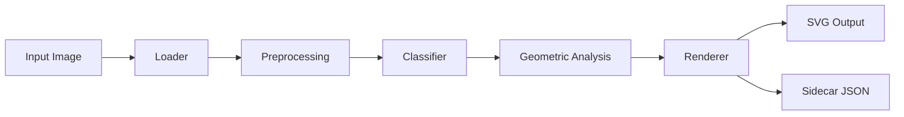

# Photo modes

`img2svg` ships ten output modes in total. Five of them target photographs and other complex raster sources: `poster`, `detailed`, `edge`, `watercolor`, and `segmented`. These five modes share a common pipeline that runs the image through an optional OpenCV preprocessing stage before the per-mode renderer takes over.

This page is the deep dive on the photo pipeline. It assumes you've read [Output modes](modes.md) for the general mode taxonomy and the renderer-vs-vtracer split.

## The photo pipeline

Every photo mode runs the same six-stage pipeline. The mode picks the renderer and the vtracer preset; everything else is shared.



1. **Loader** reads the file with Pillow and converts to a uint8 RGB (or RGBA) numpy array.
2. **Preprocessing** runs the configured OpenCV filter chain. Off by default; opt in with `--preprocess` or the convenience shortcuts.
3. **Classifier** picks an `ImageType` (`logo`, `photo`, `diagram`, `screenshot`, `line_art`, `unknown`).
4. **Geometric analysis** extracts dominant colors, edge density, and alpha presence.
5. **Renderer** is selected from the mode. Photo modes use the renderers listed in [Mode summary](#mode-summary).
6. **SVG + sidecar** are written atomically.

The five photo modes differ in the renderer and the vtracer preset they bind to. They share the same pre-YOLO stage.

## Mode summary

| Mode         | Renderer class                              | vtracer preset  | When to use                                              |
|--------------|---------------------------------------------|------------------|----------------------------------------------------------|
| `poster`     | `img2svg.renderers.poster.PosterRenderer`   | `poster`         | Stylized, limited-color output. Posters and prints.      |
| `detailed`   | `img2svg.renderers.detailed.DetailedRenderer` | `photo_hifi`   | Photographic, high-fidelity trace. The `auto` default for photos. |
| `edge`       | `img2svg.renderers.edge.EdgeRenderer`       | `bw_edge`        | Line-art, edge-only output. Pairs well with `median` preprocessing. |
| `watercolor` | `img2svg.renderers.watercolor.WatercolorRenderer` | `watercolor` | Soft, painterly output. Lower corner thresholds, larger splines. |
| `segmented`  | `img2svg.renderers.segmented.SegmentedRenderer` | `default`     | Object-by-object vectorization using YOLO segmentation. Multi-layer editable SVG. |

The mode enum is in `img2svg.enums.Mode`. The Python API takes the enum or its string value; the CLI takes the string.

```python
from img2svg import ConversionOptions
from img2svg.enums import Mode

opts = ConversionOptions(mode=Mode.DETAILED)      # enum
opts2 = ConversionOptions(mode="detailed")        # str — auto-coerced
```

## poster

`poster` is the right pick when you want a stylized, limited-color trace that looks like a screen print or marketing poster. The vtracer preset reduces the color count and uses flat, clean shapes.

**What it produces**

- Flat color regions, no fine gradients.
- Lower color precision (6 bits per channel).
- Larger `filter_speckle` than `visual`, so small specks of noise don't become paths.
- Clean edges, no anti-aliasing artifacts.

**When to use it**

- A photo that will be used as a poster, banner, or printed piece.
- Any image where you want a graphic-design aesthetic instead of a photorealistic one.
- Inputs that have a small dominant palette (a sunset, a logo on a wall, a building facade).

**Performance**

Fast. The reduced color count and simpler vtracer parameters mean a 1MP image traces in a few hundred milliseconds. CPU is fine for batch work.

**Example**

```bash
img2svg photo.jpg -o poster.svg --mode poster --max-colors 8
```

`--max-colors 8` is optional but a good pairing. It caps the output palette at 8 colors and forces a strong poster look. For a more dramatic effect, drop to 4 or 6.

Renderer: `img2svg.renderers.poster.PosterRenderer`. Preset: `img2svg.vectorizer.PRESETS["poster"]`.

## detailed

`detailed` is the photographic, high-fidelity trace. It's the default for `auto` mode on photos, which means you get this behavior whenever the classifier identifies an image as a `photo` and you didn't pick a mode explicitly.

**What it produces**

- High color precision (8 bits per channel) so subtle gradients are preserved.
- Smaller `filter_speckle` (4 px) so fine details survive the trace.
- Tighter `layer_difference` (24) so adjacent color regions don't merge.
- More aggressive `max_iterations` (20) and a higher `path_precision` (4) than `visual`.

**When to use it**

- Any photo where you want a clean SVG that still looks like the source.
- Editorial workflows that need a vector version of a photograph.
- Assets that will be scaled up — the higher path precision pays off at large sizes.
- The default starting point for photo work; switch to `poster`, `edge`, or `watercolor` only when you have a specific stylistic goal.

**Performance**

Slower than `visual` or `poster` because the vtracer parameters are stricter. On a 1MP image, expect 1-2 seconds on CPU and under 200 ms on a discrete GPU. A `photo_hifi` preset is a real cost — the sidecar's `timings.vectorize` is typically the largest entry.

**Example**

```bash
img2svg photo.jpg -o photo.svg --mode detailed
img2svg photo.jpg -o photo.svg --mode detailed --preprocess bilateral --preprocess unsharp
```

The second command chains a denoise + sharpen step before vtracer runs. See [Preprocessing](#preprocessing) for the full filter list and chain semantics.

Renderer: `img2svg.renderers.detailed.DetailedRenderer`. Preset: `img2svg.vectorizer.PRESETS["photo_hifi"]`.

## edge

`edge` produces a line-art, edge-only trace. The renderer runs vtracer in `polygon` mode with a high corner threshold and a binary color mode, which yields sharp, geometric line work instead of color-filled shapes.

**What it produces**

- Binary (black/white) output by default.
- Polygon-mode paths (sharp corners, no smoothing).
- Higher `corner_threshold` (120) so subtle curves collapse to straight segments.
- Larger `filter_speckle` (8 px) than `detailed` so small edges are dropped.

**When to use it**

- Architectural photos, product silhouettes, technical illustrations.
- Sketches and hand-drawn line art (use with `--preprocess median` to clean up scan noise).
- Anytime you want a "pencil sketch" or "outline only" look from a photo.

**Performance**

Fast. Binary colormode and polygon tracing are both cheaper than color splines. A 1MP image runs in 100-300 ms on CPU.

**Example**

```bash
img2svg sketch.png -o sketch.svg --mode edge
img2svg building.jpg -o building.svg --mode edge --preprocess median
```

The second example runs a median denoise first to clean up JPEG artifacts from the building photo before the Canny-style edge trace. The `median` filter is a small (3x3) kernel; for noisier inputs, pass `median` twice or use `nlmeans`.

Renderer: `img2svg.renderers.edge.EdgeRenderer`. Preset: `img2svg.vectorizer.PRESETS["bw_edge"]`.

## watercolor

`watercolor` produces a soft, painterly output. The vtracer preset lowers the corner threshold, increases the layer difference, and uses longer splines, which gives the trace a hand-painted feel.

**What it produces**

- Color regions with soft, large-radius splines.
- Lower `corner_threshold` (20) so subtle curves are preserved as curves rather than collapsed to lines.
- Larger `length_threshold` (5.0) so very short segments are dropped.
- Higher `filter_speckle` (14 px) so noise doesn't become paths.

**When to use it**

- Landscapes, portraits, and other images where a painterly look fits the content.
- Decorative or artistic contexts where the geometric precision of `detailed` is too clinical.
- Style transfers where you want the SVG to look like an illustration rather than a photo.

**Performance**

Similar to `detailed`. The watercolor preset has more `max_iterations` (15) than `poster` or `visual`, so a 1MP image takes 800 ms to 1.5 s on CPU.

**Example**

```bash
img2svg landscape.jpg -o landscape.svg --mode watercolor
img2svg portrait.jpg -o portrait.svg --mode watercolor --denoise bilateral
```

`--denoise bilateral` (a shortcut for `--preprocess bilateral`) cleans sensor noise out of the source before the watercolor trace. Bilateral is edge-preserving, so it won't blur the portrait's eye and mouth detail.

Renderer: `img2svg.renderers.watercolor.WatercolorRenderer`. Preset: `img2svg.vectorizer.PRESETS["watercolor"]`.

## segmented

`segmented` is the only multi-layer mode. The image is fed to a YOLO segmentation model, which returns one mask per detected object. Each mask is traced independently with vtracer's `photo_hifi` preset, and the resulting paths are grouped by object class in the output SVG. The background is traced separately and emitted as its own group.

**What it produces**

A multi-layer editable SVG with one `<g id="obj_<class>_<idx>">` per detection and a `<g id="background" data-role="background">` for everything else. Each object group carries `data-class` and `data-conf` attributes for downstream tooling. The structure looks like:

```
<svg>
  <title/><desc/><style/>
  <g id="background" data-role="background">...</g>
  <g id="obj_person_0" data-class="person" data-conf="0.91">...</g>
  <g id="obj_dog_1" data-class="dog" data-conf="0.87">...</g>
  ...
</svg>
```

**When to use it**

- Photos with multiple recognizable objects (people, cars, animals, products).
- Workflows that need to edit one object at a time in Inkscape or Illustrator.
- Datasets where you want per-object metadata in the SVG.
- Asset generation for catalogs, listings, or any context where objects need to be addressable.

**Performance**

Slower than the other photo modes. YOLO inference runs once, then vtracer runs once per detected object. A 1MP photo with 5 detections takes 1-3 seconds on CPU. On a discrete GPU the YOLO call drops to 50-100 ms; vtracer still runs on CPU. With `--no-seg`, the segmentor is skipped and the mode falls back to a single whole-image trace (same behavior as `visual`).

**Example**

```bash
img2svg group.jpg -o group.svg --mode segmented --seg-model yolo11s-seg
img2svg group.jpg -o group.svg --mode segmented --seg-model yolo11x-seg
img2svg group.jpg -o group.svg --mode annotated --no-seg
```

The second command uses a larger, more accurate segmentation model. The third command is unrelated to `segmented` mode but shows the `--no-seg` flag in action on a different mode.

Renderer: `img2svg.renderers.segmented.SegmentedRenderer`. The YOLO segmentor is `img2svg.detector.YOLOSegmentor`. The per-region tracer is `img2svg.detector.trace_region`. See [Segmentation](#segmentation) for the model variants and VRAM tradeoffs.

## Preprocessing

Photo modes accept an optional preprocessing chain. The chain runs on the loaded image *before* the renderer and vtracer see it. By default preprocessing is off, so the trace is faithful to the source. Turn it on for noisy inputs, low-detail scans, or any time you want a cleaner vector.

The available filters live in `img2svg.preprocessing`. They're composed by passing a list of `(filter_name, kwargs)` tuples to a `PreprocessingPipeline`, or from the CLI via `--preprocess`, `--denoise`, and `--sharpen`.

### CLI flags

| Flag            | Repeatable | Description                                                            |
|-----------------|------------|------------------------------------------------------------------------|
| `--preprocess`  | Yes        | One filter to apply. May be repeated to chain filters.                 |
| `--denoise`     | No         | Convenience shortcut for a single denoise filter.                      |
| `--sharpen`     | No         | Convenience shortcut for a single sharpen filter.                      |
| `--no-preprocess` | No        | Disable all preprocessing, overriding any positive choices.            |

The available filter names are `bilateral`, `nlmeans`, `median` (denoise), and `unsharp` (sharpen). `--denoise` and `--sharpen` accept the same names except `unsharp` is the only sharpen value.

### Filter reference

| Filter      | Purpose                              | Cost      | Best paired with            |
|-------------|--------------------------------------|-----------|------------------------------|
| `bilateral` | Edge-preserving denoise              | Medium    | Most photos                  |
| `nlmeans`   | Stronger statistical denoise         | High      | Noisy or grainy photos       |
| `median`    | Salt-and-pepper / JPEG block cleanup  | Low       | Edge mode, scanned line art  |
| `unsharp`   | Edge sharpening via unsharp mask     | Low       | Any trace mode               |

Filters run in the order given. A typical chain is `bilateral` followed by `unsharp`:

```bash
img2svg photo.jpg -o photo.svg --preprocess bilateral --preprocess unsharp
```

`--denoise bilateral` is shorthand for the first step. To combine a denoise and a sharpen, you need `--preprocess` twice (because `--denoise` and `--sharpen` are single-value flags):

```bash
img2svg photo.jpg -o photo.svg --denoise bilateral --sharpen unsharp
```

### When preprocessing helps

- **Bilateral denoise** cleans sensor noise without blurring edges. Default choice for `detailed` and `watercolor` modes.
- **NL means denoise** is a stronger filter. Use it on a known-noisy input (high ISO, low light). It is significantly slower than bilateral.
- **Median denoise** drops JPEG block artifacts and salt-and-pepper noise. Pairs naturally with `edge` mode.
- **Unsharp sharpen** recovers edge crispness that denoise may have softened. Use it after any denoise step.

### When preprocessing hurts

- For inputs that are already clean (a vectorized logo re-rasterized, a screenshot, a clean illustration), preprocessing adds no value and slows the run. Use `--no-preprocess` to skip it.
- For `edge` mode with already-binary line art, preprocessing will erase thin features. Skip it.
- For `poster` mode, the trace is already stylized — preprocessing amplifies noise rather than reducing it. Skip it.

### Python API

The `ConversionOptions` model carries the preprocessing configuration:

```python
from img2svg import ConversionOptions

opts = ConversionOptions(
    mode="detailed",
    preprocess=["bilateral", "unsharp"],   # filter chain
    denoise="bilateral",                   # shortcut, equivalent to preprocess=["bilateral"]
    sharpen="unsharp",                     # shortcut, equivalent to preprocess=["unsharp"]
    no_preprocess=False,
)
```

`--no-preprocess` corresponds to `no_preprocess=True`. When set, it overrides any positive `preprocess` choices and runs the raw image through the renderer.

## Segmentation

`segmented` mode is the only mode that invokes a YOLO segmentation model. The segmentor runs on the GPU (when one is available) and produces one mask per detected object. The masks are then traced per-region with vtracer's `photo_hifi` preset, and the resulting paths are grouped in the output SVG.

### Model variants

The `--seg-model` flag picks the YOLO segmentation weights. Smaller models are faster; larger models are more accurate. The available models are:

| Model          | Approx. weights size | VRAM (inference) | Notes                                       |
|----------------|----------------------|------------------|---------------------------------------------|
| `yolo11n-seg`  | ~5 MB                | ~1 GB            | Fastest, lowest accuracy. Mobile / CI.      |
| `yolo11s-seg`  | ~20 MB               | ~1.5 GB          | Default. Good speed/accuracy balance.       |
| `yolo11m-seg`  | ~40 MB               | ~3 GB            | Higher accuracy, slower.                    |
| `yolo11l-seg`  | ~50 MB               | ~5 GB            | High accuracy.                              |
| `yolo11x-seg`  | ~100 MB              | ~8 GB            | Highest accuracy, slowest.                  |

The default is `yolo11s-seg`. The pipeline auto-falls-back to a smaller model on out-of-memory errors, so a 512 MB iGPU can still run `segmented` mode (it'll fall back to `yolo11n-seg`, then to bbox detection only).

### VRAM considerations

The 512 MB iGPU caveat from [Installation](installation.md#amd-rocm) applies to segmentation too. `yolo11x-seg` is not realistic on iGPUs. Use `yolo11n-seg` or `yolo11s-seg`, or fall back to CPU:

```bash
img2svg group.jpg -o group.svg --mode segmented --seg-model yolo11n-seg --device cpu
```

The pipeline catches out-of-memory errors during YOLO inference and falls back to a smaller model automatically. If the fallback chain exhausts itself, the run fails with a clear error naming the model that didn't fit.

### No segmentation

`--no-seg` disables the segmentor even when `segmented` mode is active. The renderer falls back to a single whole-image trace (same as `visual`). This is useful for testing the renderer in isolation, or for benchmarking the per-mode cost without paying the YOLO inference time.

```bash
img2svg group.jpg -o group.svg --mode segmented --no-seg
```

`--no-seg` is also accepted on other modes (such as `annotated`) where it suppresses the detection overlays. In that case, `annotated --no-seg` behaves identically to `visual`.

### Sidecar metadata

The sidecar JSON for a `segmented` run carries the per-region metadata in the `regions` field. Each region has:

- `class_id` and `class_name` (from the YOLO model)
- `confidence` (0.0 to 1.0)
- `bbox` (in image pixel coordinates)
- `area_pixels` (mask area, in pixels)
- `polygon` (the mask as a list of `(x, y)` tuples)
- `mask_path` (optional; reserved for future use)

A short example:

```json
{
  "mode_used": "segmented",
  "model_variant": "yolo11s-seg",
  "regions": [
    {
      "class_id": 0,
      "class_name": "person",
      "confidence": 0.91,
      "bbox": {"x1": 120, "y1": 80, "x2": 320, "y2": 480},
      "area_pixels": 84210,
      "polygon": [[120, 80], [121, 79], [122, 78], ...]
    }
  ]
}
```

The `regions` field is empty for non-segmented modes. The `model_variant` field is set to the `--seg-model` value for any run that loaded the segmentor, even if the active mode didn't use the masks.

## Examples

The same source image rendered in each photo mode:

```bash
img2svg photo.jpg -o photo.poster.svg     --mode poster
img2svg photo.jpg -o photo.detailed.svg   --mode detailed
img2svg photo.jpg -o photo.edge.svg       --mode edge
img2svg photo.jpg -o photo.watercolor.svg --mode watercolor
img2svg photo.jpg -o photo.segmented.svg  --mode segmented --seg-model yolo11s-seg
```

The five outputs differ in:

- **File size**: `edge` is usually smallest; `segmented` is largest (one path group per object); `detailed` and `watercolor` are in the middle.
- **Editability**: `segmented` is the most editable. Each object is its own SVG group with a stable `id`. `edge` and `watercolor` are good for editing in vector tools; `detailed` and `poster` carry many small paths.
- **Color count**: `edge` is binary; `poster` is the lowest-color; `watercolor` and `detailed` are the highest.
- **Detection metadata**: only `segmented` carries per-region metadata in the SVG and sidecar.

### Common combinations

**Aggressive denoise + detailed trace** — for high-ISO or low-light photos:

```bash
img2svg photo.jpg -o photo.svg --mode detailed --denoise nlmeans --sharpen unsharp
```

**Edge mode with median cleanup** — for scanned line art or product photos with JPEG artifacts:

```bash
img2svg sketch.png -o sketch.svg --mode edge --preprocess median
```

**Poster with a tight color cap** — for marketing assets:

```bash
img2svg product.jpg -o product.svg --mode poster --max-colors 6
```

**Segmented with the largest model on GPU** — for high-stakes catalog work:

```bash
img2svg group.jpg -o group.svg --mode segmented --seg-model yolo11x-seg --device cuda:0
```

**No-preprocess baseline** — for inputs that are already clean, or to compare against the preprocessed output:

```bash
img2svg photo.jpg -o photo.svg --mode detailed --no-preprocess
```

## Choosing a photo mode

A short decision tree:

1. Do you want a stylized, non-photographic look?
   - Yes, flat colors → `poster`.
   - Yes, hand-painted look → `watercolor`.
   - Yes, line-art look → `edge`.
   - No, continue.
2. Do you want per-object groups in the output SVG?
   - Yes → `segmented` (slowest, most editable).
   - No, continue.
3. Do you want a high-fidelity vector of the source?
   - Yes → `detailed`.
   - Not sure → `detailed` is the right default.

For automatic mode selection, use `--mode auto` and let the classifier pick. The auto-mode rule is:

- `photo` → `detailed`
- `logo`, `diagram`, `screenshot`, `line_art`, `unknown` → `visual`

`auto` never picks `poster`, `edge`, `watercolor`, or `segmented` — those are explicit choices. See [Output modes](modes.md#auto) for the full auto-mode logic.

## Forcing a mode from Python

The Python API takes the enum or its string value:

```python
from img2svg import convert, ConversionOptions

# String value
convert("photo.jpg", "photo.svg", mode="detailed")

# Enum value (for static type checking)
from img2svg.enums import Mode
convert("photo.jpg", "photo.svg", options=ConversionOptions(mode=Mode.DETAILED))
```

Combining a photo mode with preprocessing and segmentation:

```python
from img2svg import convert, ConversionOptions

opts = ConversionOptions(
    mode="segmented",
    seg_model="yolo11s-seg",
    preprocess=["bilateral", "unsharp"],
    max_colors=16,
    device="cuda:0",
)
result = convert("group.jpg", "group.svg", options=opts)
print(f"wrote {result.svg_path} with {len(result.sidecar.regions)} regions")
```

## See also

- [Output modes](modes.md) — the full mode taxonomy and the non-photo modes.
- [Usage](usage.md) — CLI examples for each flag, including `--preprocess` and `--seg-model`.
- [Python API](api.md) — `ConversionOptions` reference, including the new photo-mode fields.
- [Architecture](architecture.md) — how preprocessing and segmentation wire into the pipeline.
- [Installation](installation.md#amd-rocm) — VRAM caveats and iGPU notes.
